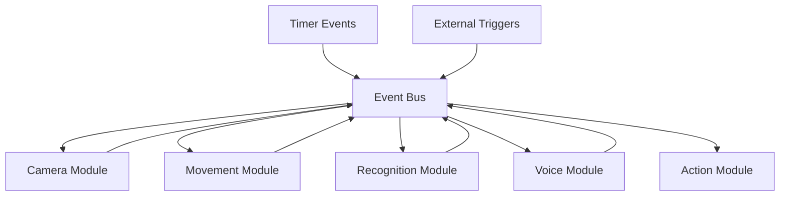
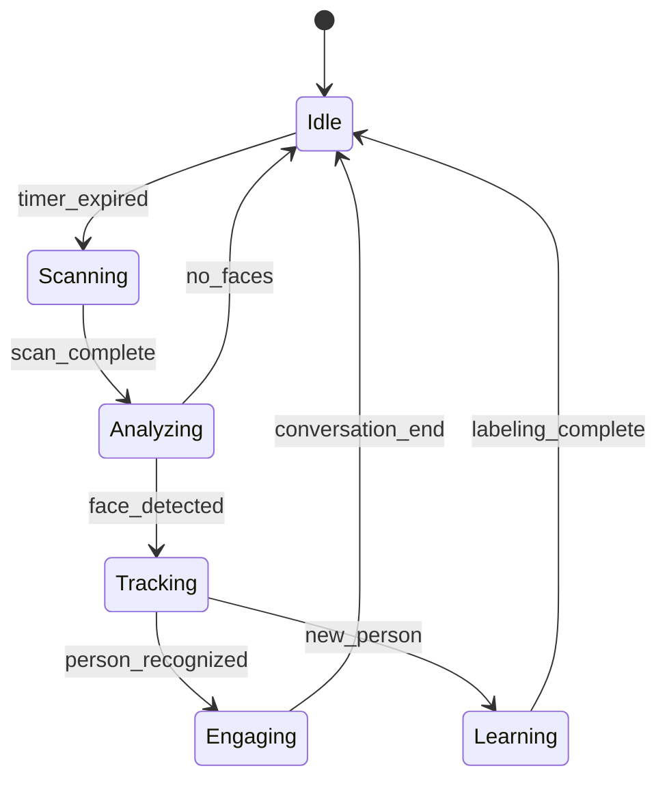

# Robot Architecture Outline

## Overview

This document outlines comprehensive architectural approaches for transforming the current pyraspibot codebase into a robust, event-driven robot system capable of handling face detection, person recognition, voice interaction, and autonomous operation.

## Current State Analysis

### Existing Structure
- **Core modules**: room_scan.py provides one-shot scanning with face detection
- **Hardware layer**: Camera with AI detection, servo control via PCA9685/GPIO
- **Vision layer**: Face detection with OpenCV, object deduplication
- **Movement layer**: Pan/tilt scanning patterns
- **Configuration**: Centralized settings management

### Current Challenges
1. **Performance**: Face detection reducing frame rate substantially
2. **Architecture**: No event system for autonomous operation
3. **Memory**: No face recognition database or person identification
4. **Interaction**: No manual labeling system for people
5. **Integration**: No framework for future voice/LLM capabilities

## Performance Optimization Strategies

### Option 1: Pipeline Optimization
```
Camera → Grayscale Conversion → Face Detection → Recognition
   ↓                              ↓              ↓
Preview     →     Frame Buffer  →  Event Queue  →  Action
```

**Approaches:**
- **Grayscale conversion at camera level** (Picamera2 sensor configuration)
- **Frame skipping** for detection (every 3rd frame for recognition)
- **Multi-threading** separation of preview vs detection
- **Resolution scaling** (lower resolution for detection, full for preview)

### Option 2: Dual Processing Streams
```
High-Res Stream → Preview Display
Low-Res Stream  → AI Processing → Event Generation
```

**Benefits:**
- Maintains smooth preview
- Optimizes detection performance
- Separate processing pipelines

## Event-Driven Architecture Options

### Option A: Central Event Bus Pattern



**Components:**
- **EventBus**: Central message routing (`raspibot/core/events.py`)
- **Event Types**: `FaceDetected`, `PersonRecognized`, `VoiceCommand`, `TimerExpired`
- **Subscribers**: Modules register for specific event types
- **Publishers**: Hardware modules emit events

### Option B: State Machine Architecture



**States:**
- **Idle**: Default state, minimal processing
- **Scanning**: Room scan for optimal camera position
- **Analyzing**: Processing detections, building database
- **Tracking**: Following known/unknown persons
- **Engaging**: Active interaction (voice/visual)
- **Learning**: Manual labeling mode

### Option C: Hybrid Event-State Architecture (Recommended)

Combines event bus with state machine for optimal flexibility:

```python
# Pseudo-code structure
class RobotController:
    def __init__(self):
        self.event_bus = EventBus()
        self.state_machine = RobotStateMachine()
        self.modules = {
            'camera': CameraModule(),
            'movement': MovementModule(),
            'recognition': RecognitionModule(),
            'voice': VoiceModule()
        }
    
    async def run(self):
        while True:
            # Process events
            events = await self.event_bus.get_events()
            for event in events:
                new_state = self.state_machine.process(event)
                if new_state:
                    await self.transition_to_state(new_state)
            
            # Execute state-specific behavior
            await self.state_machine.current_state.execute()
```

## Face Recognition Database Design

### Option 1: SQLite with Vector Extensions
```sql
-- Person management
CREATE TABLE persons (
    id INTEGER PRIMARY KEY,
    name TEXT,
    status TEXT, -- 'known', 'learning', 'guest'
    created_at TIMESTAMP,
    last_seen TIMESTAMP
);

-- Face encodings (using vector extension)
CREATE TABLE face_encodings (
    id INTEGER PRIMARY KEY,
    person_id INTEGER,
    encoding BLOB, -- face embedding vector
    confidence FLOAT,
    source_frame_id TEXT,
    created_at TIMESTAMP,
    FOREIGN KEY (person_id) REFERENCES persons(id)
);

-- Detection sessions
CREATE TABLE detection_sessions (
    id INTEGER PRIMARY KEY,
    person_id INTEGER,
    start_time TIMESTAMP,
    end_time TIMESTAMP,
    frame_count INTEGER,
    best_frame_path TEXT,
    FOREIGN KEY (person_id) REFERENCES persons(id)
);
```

### Option 2: File-Based with Metadata
```
data/
├── faces/
│   ├── persons/
│   │   ├── person_001/
│   │   │   ├── encodings.npy
│   │   │   ├── best_frames/
│   │   │   └── metadata.json
│   │   └── person_002/
│   └── unknown/
│       ├── session_20241119_143022/
│       └── session_20241119_143156/
└── face_db.json  # Person registry
```

### Option 3: Hybrid Database (Recommended)
- **SQLite** for person metadata and session tracking
- **NumPy files** for face encodings (faster similarity search)
- **Automatic clustering** to prevent duplicate person entries
- **Confidence scoring** to improve recognition over time

```python
class FaceRecognitionDB:
    def __init__(self, db_path: str, encodings_dir: str):
        self.db = sqlite3.connect(db_path)
        self.encodings_dir = Path(encodings_dir)
        self.similarity_threshold = 0.6
    
    async def identify_person(self, face_encoding: np.ndarray) -> Optional[Dict]:
        """Find matching person or create new entry."""
        similarities = await self.compute_similarities(face_encoding)
        
        if similarities and max(similarities.values()) > self.similarity_threshold:
            return await self.get_best_match(similarities)
        else:
            return await self.create_new_person(face_encoding)
    
    async def update_person_encoding(self, person_id: int, new_encoding: np.ndarray):
        """Update person's face encoding with temporal smoothing."""
        # Implement rolling average of encodings for robustness
```

## Manual Labeling System Design

### Option 1: Web Interface
```
Web UI (Flask/FastAPI) ← → Robot API ← → Face Database
    ↓                           ↓
Labeling Interface         Active Detection
```

**Features:**
- Real-time face detection preview
- Drag-and-drop labeling interface
- Session review and correction
- Person merging/splitting tools

### Option 2: Voice-Based Labeling
```python
class VoiceLabelingSystem:
    async def prompt_for_name(self, person_id: int):
        """Ask person to state their name."""
        await self.voice_module.speak("Hello! Could you please tell me your name?")
        name = await self.voice_module.listen_for_response(timeout=10)
        
        if name:
            await self.face_db.update_person_name(person_id, name)
            await self.voice_module.speak(f"Nice to meet you, {name}!")
```

### Option 3: Mobile App Interface
- **Real-time sync** with robot database
- **Photo review** and labeling
- **Family/household** management
- **Privacy controls** for guest mode

## Voice/LLM Integration Architecture

### Modular Agent Framework
```python
class ConversationAgent:
    def __init__(self):
        self.tools = {
            'face_recognition': FaceRecognitionTool(),
            'camera_control': CameraControlTool(),
            'movement_control': MovementTool(),
            'memory': MemoryTool()
        }
        self.llm_client = LLMClient()  # Your existing framework
    
    async def process_command(self, audio_input: bytes) -> str:
        # Speech-to-text
        text = await self.stt.transcribe(audio_input)
        
        # LLM processing with tools
        response = await self.llm_client.chat(
            messages=[{"role": "user", "content": text}],
            tools=self.tools
        )
        
        # Execute tool calls and respond
        result = await self.execute_tools(response.tool_calls)
        return await self.tts.synthesize(result)
```

## Main Robot Controller Design

### Core Event Loop Structure
```python
class PyRaspibotController:
    """Main robot controller implementing event-driven architecture."""
    
    def __init__(self):
        # Core systems
        self.event_bus = EventBus()
        self.state_machine = RobotStateMachine()
        self.scheduler = AsyncScheduler()
        
        # Hardware modules
        self.camera = Camera(face_detection=True)
        self.servo_controller = get_servo_controller()
        self.room_scanner = RoomScanner(self.camera, self.servo_controller)
        
        # Intelligence modules
        self.face_db = FaceRecognitionDB()
        self.voice_agent = ConversationAgent()
        self.labeling_system = VoiceLabelingSystem()
        
        # Configuration
        self.config = self._load_operational_config()
        
    async def run(self):
        """Main robot operation loop."""
        await self._initialize_systems()
        
        # Schedule periodic tasks
        self.scheduler.schedule_periodic(
            self._periodic_room_scan, 
            interval=self.config.room_scan_interval
        )
        
        # Main event loop
        while True:
            try:
                # Process hardware events
                await self._process_camera_events()
                await self._process_voice_events()
                
                # Handle scheduled tasks
                await self.scheduler.run_pending()
                
                # Execute current state behavior
                await self.state_machine.execute_current_state()
                
                # Small delay to prevent busy waiting
                await asyncio.sleep(0.1)
                
            except KeyboardInterrupt:
                await self._shutdown()
                break
            except Exception as e:
                self.logger.error(f"Main loop error: {e}")
                await self._handle_error(e)
    
    async def _process_camera_events(self):
        """Process face detection and recognition events."""
        if not self.camera.tracked_objects:
            return
            
        for obj in self.camera.tracked_objects:
            if obj['label'] == 'person':
                # Extract face and attempt recognition
                face_data = await self._extract_face_features(obj)
                if face_data:
                    person = await self.face_db.identify_person(face_data['encoding'])
                    
                    if person['status'] == 'new':
                        await self.event_bus.emit(Events.NEW_PERSON_DETECTED, person)
                    elif person['status'] == 'known':
                        await self.event_bus.emit(Events.KNOWN_PERSON_DETECTED, person)
    
    async def _periodic_room_scan(self):
        """Periodic room scanning for optimal positioning."""
        current_time = time.time()
        
        # Only scan if no active interaction and enough time passed
        if (self.state_machine.current_state == States.IDLE and 
            current_time - self.last_scan_time > self.config.room_scan_interval):
            
            scan_results = await self.room_scanner.scan_room_async()
            optimal_position = self._calculate_optimal_position(scan_results)
            
            if optimal_position:
                await self.servo_controller.move_to_position_async(
                    optimal_position['pan'], optimal_position['tilt']
                )
```

### Event Definitions
```python
class Events:
    # Detection events
    FACE_DETECTED = "face_detected"
    NEW_PERSON_DETECTED = "new_person_detected" 
    KNOWN_PERSON_DETECTED = "known_person_detected"
    PERSON_LOST = "person_lost"
    
    # Voice events
    WAKE_WORD_DETECTED = "wake_word_detected"
    VOICE_COMMAND = "voice_command"
    CONVERSATION_END = "conversation_end"
    
    # System events
    ROOM_SCAN_COMPLETE = "room_scan_complete"
    ERROR_OCCURRED = "error_occurred"
    SHUTDOWN_REQUESTED = "shutdown_requested"
    
    # Timer events
    PERIODIC_SCAN_TIMER = "periodic_scan_timer"
    IDLE_TIMEOUT = "idle_timeout"
```

## Implementation Phases

### Phase 1: Core Event System
1. Create `raspibot/core/events.py` - EventBus implementation
2. Create `raspibot/core/robot_controller.py` - Main controller
3. Modify existing modules to emit events
4. Basic state machine implementation

### Phase 2: Face Recognition Database
1. Design and implement database schema
2. Create `raspibot/intelligence/face_recognition.py`
3. Integrate with existing face detection
4. Add person identification logic

### Phase 3: Manual Labeling System
1. Implement voice-based labeling
2. Create simple web interface (optional)
3. Add person management commands
4. Privacy and guest mode features

### Phase 4: Voice Integration
1. Add speech-to-text capabilities
2. Integrate with existing LLM framework
3. Create conversation tools for robot control
4. Implement wake word detection

### Phase 5: Advanced Features
1. Predictive positioning based on person patterns
2. Multi-person conversation handling
3. Advanced memory and context management
4. Mobile app integration

## Configuration Management

### Operational Settings
```python
# raspibot/settings/robot_config.py
class RobotOperationalConfig:
    # Scanning behavior
    room_scan_interval: int = 300  # 5 minutes
    auto_position_enabled: bool = True
    idle_timeout: int = 60  # seconds
    
    # Recognition settings
    face_recognition_enabled: bool = True
    auto_labeling_enabled: bool = False
    guest_mode_timeout: int = 3600  # 1 hour
    
    # Voice settings
    wake_word_enabled: bool = False  # Future
    conversation_timeout: int = 30
    
    # Performance settings
    face_detection_frame_skip: int = 3
    detection_resolution: Tuple[int, int] = (640, 480)
    preview_resolution: Tuple[int, int] = (1280, 720)
```

## Benefits of This Architecture

1. **Modularity**: Each component can be developed and tested independently
2. **Scalability**: Easy to add new capabilities (sensors, voice, etc.)
3. **Performance**: Optimized processing pipelines
4. **Maintainability**: Clear separation of concerns
5. **Testability**: Event-driven design enables comprehensive testing
6. **Extensibility**: Framework ready for future AI/LLM integration

## Migration Strategy

1. **Preserve existing functionality** - All current features continue working
2. **Gradual integration** - Add new components alongside existing code
3. **Configuration-driven** - Enable new features via config flags
4. **Backward compatibility** - Existing examples and tests continue working
5. **Documentation** - Comprehensive guides for each new component

This architecture provides a solid foundation for evolving the pyraspibot into a sophisticated, autonomous robot system while maintaining the hobbyist-friendly approach and preserving all existing functionality.